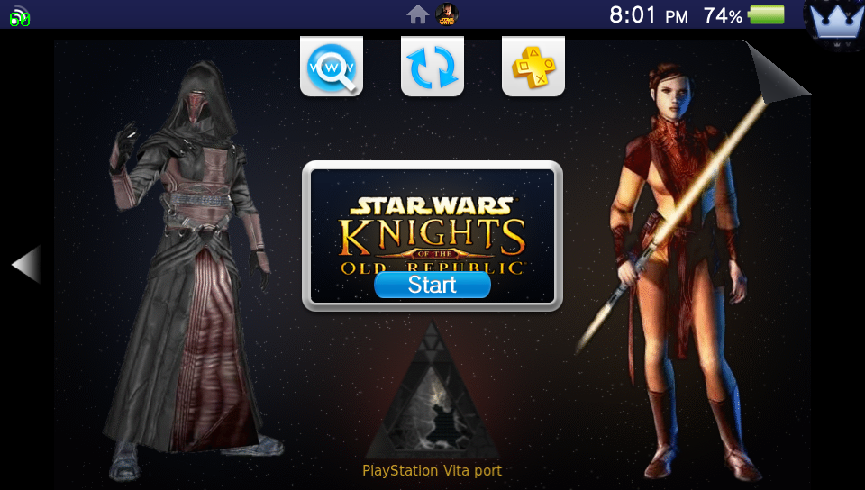
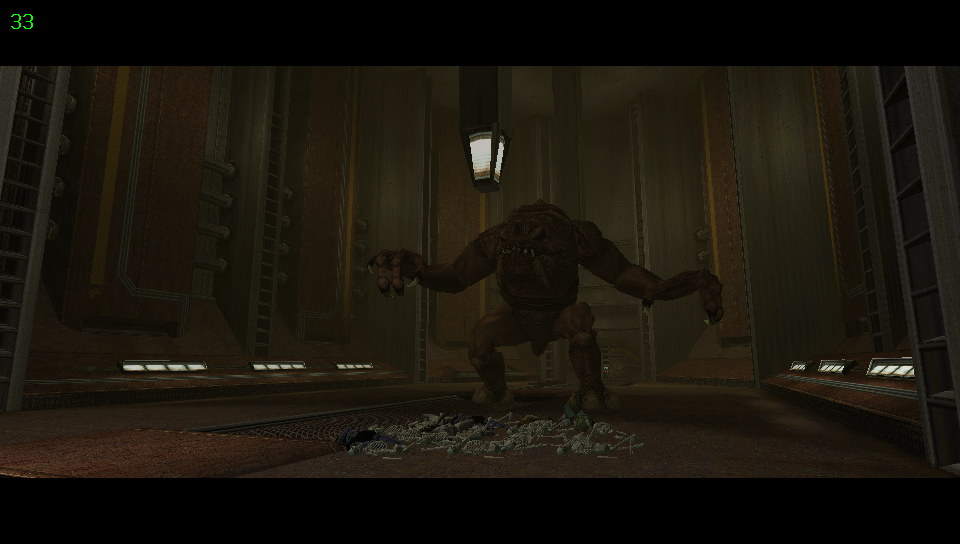

# VitaKotor

**Star Wars: Knights of the Old Republic on the PlayStation Vita.**

A native Vita port of the *Android* release of KOTOR, built with the so-loader
technique: rather than reimplementing the game, the loader loads Aspyr's own ARM
libraries straight from your copy of the Android build, resolves everything they
import against Vita equivalents, and hands control to the game's real entry
point. Graphics run through [vitaGL](https://github.com/Rinnegatamante/vitaGL),
with a from-scratch FMOD audio implementation over `sceAudiodec` and
`sceAudioOut` underneath.

> **You must own the Android version of KOTOR.** Nothing here contains game
> code or data — only the loader, plus artwork used for the LiveArea. It does
> nothing on its own. You supply the game.

## Screenshots

<p align="center">
  
  
</p>

---

## Status

**Work in progress — good enough for a real playthrough, if you save regularly.**

It boots, gets through character creation, and plays through the Endar Spire and
across Taris. Combat, dialogue, inventory, containers and saves all work, and it
looks and sounds like the game.

The two faults that used to wear a long session down are **fixed**: sound no
longer thins out and goes silent, and the world geometry no longer tears into
spikes. Sessions of close to 90 minutes now end as healthy as they started.
What remains is frame rate and a few rough edges. Nothing crashes and no save
has been lost. See [Known issues](#known-issues).

So: worth starting a proper playthrough on now. Save regularly all the same.

| | |
|---|---|
| Startup | ~2 min on first launch, then under a minute |
| Area loads | Under a second to load; the loading screen then stays up 15–20 s while textures upload |
| Frame rate | ~30–38 fps typical, dips into the low 20s in dense scenes, with stutters |
| Session length | ~100 min tested with nothing fatal and nothing wearing down |
| Audio | Effects, voice and music all work |
| Cutscenes | Bink movies play with sound; tap or press a button to skip |
| Input | Touchscreen, sticks and buttons — see [Controls](#controls) |
| Saves | Work, stored on the Vita |
| Mods | Work — KOTOR 1 Restoration plus six more played together; see [Mods](#mods) |

`main` is usually ahead of the newest [release](../../releases); the issue list
below says which fixes have not been released yet.

---

## Requirements

**On the Vita**

- A Vita or PS TV on firmware that can run [HENkaku](https://henkaku.xyz/) / taiHEN
- [`kubridge.skprx`](https://github.com/bythos14/kubridge/releases) installed as a taiHEN plugin
- `libshacccg.suprx` in `ur0:data/` — the runtime shader compiler. Use
  [this installer](https://github.com/Rinnegatamante/vita-shacccg-installer) if
  you don't have it. **Without it the game hangs on a black screen** at the
  first shader compile, with no error message.
- Roughly **2.7 GB** free on `ux0:`

**From your own copy of the game**

The Android release: the `.apk` and both `.obb` expansion files. An `.apk` is
just a zip — open it with any archive tool to get at the libraries inside.

---

## Installation

1. **Install `KOTOR.vpk`** — from [Releases](../../releases) — with VitaShell.

2. **Create `ux0:data/kotor/`** on your Vita.

3. **Copy four libraries** out of your APK, from `lib/armeabi-v7a/`:

   ```
   libKOTOR.so
   libandroid_port.so
   libminiz.so
   libLzmaLib.so
   ```

4. **Copy both expansion files**, renaming them exactly:

   ```
   main.<version>.com.aspyr.swkotor.obb   ->  main.obb    (~2.1 GB)
   patch.<version>.com.aspyr.swkotor.obb  ->  patch.obb   (~453 MB)
   ```

5. **Launch it.** The **first** boot takes around two minutes: it reads through
   the 2.1 GB archive and records what it needed into `main.obb.idx` beside it.
   Every boot after that reuses the recording and reaches the game in under a
   minute. A progress bar is on screen throughout, so you can tell it is
   working rather than hung.

   Delete the `.idx` files if you ever replace an `.obb`; they are rebuilt
   automatically, and a mismatched one is ignored rather than trusted.

You should end up with:

```
ux0:data/kotor/
├── libKOTOR.so
├── libandroid_port.so
├── libminiz.so
├── libLzmaLib.so
├── main.obb
└── patch.obb
```

The loader adds `main.obb.idx`, `patch.obb.idx`, `startup.tim` and `log.txt`
here on first run.

Shaders and font metrics ship inside the VPK, so there is nothing else to copy.

---

## Controls

KOTOR's native Android gamepad path is mapped to the Vita controls. The left
stick moves, the right stick controls the camera, the D-pad navigates, and the
face buttons follow the familiar layout: Cross accepts, Circle cancels, Square
is X, and Triangle is Y. L and R are the shoulder actions; Start opens the
game's pause path. Select is currently reserved.

The front touchscreen works too, and you can mix it freely with the buttons:
tap menu items, dialogue choices and the on-screen combat buttons directly.
Some actions, like a normal attack, are easiest to reach by touch, since the
Vita has no L2/R2 for the Android layout's triggers. The rear touch panel is
off, so holding the console never taps anything.

**Typing a name** — your character's, or a save's — opens the Vita's on-screen
keyboard. Select the name field and confirm to bring it up, then type and accept.

## Language

The game ships its text in five languages, and the Android release picked one
from the phone's locale. There is no locale to read on the Vita, so the port
asks you instead.

**The first time you run it**, a short list comes up before the loading screen:

```
                       CHOOSE A LANGUAGE

                         > ENGLISH
                           FRANCAIS
                           ITALIANO
                           DEUTSCH
                           ESPANOL
```

Up and down to move. The bottom of the screen names the buttons — confirm is
whichever button your console uses to confirm, and the other one leaves things
alone. Your choice is saved and you are not asked again. **To change it later,
press L while the game is starting** — any time from launching it until the
loading screen appears, while the screen is still black — and the list comes
back.

The choice is written to `ux0:data/kotor/swkotor.ini`, and you can equally set
it there by hand:

```ini
[Game Options]
Language=fr
```

`en` (the default), `fr`, `it`, `de` and `es`. Anything else, or no line at all,
gives you English. If the section is not in your ini yet, add it.

This changes the on-screen text and the main-menu artwork. **Voice-over stays
English** in every language — the game data only ever shipped one set of
recordings, so this is what the retail releases did too.

### Fan translations

Unofficial translations show up in the same list, below the five built-in
languages. Give each one its own folder:

```
ux0:data/kotor/translations/Polski/tv_dialog.tlk
```

The folder name is what the list shows, so name it after the language. The
file inside can be called `tv_dialog.tlk` or `dialog.tlk`; either works. Then
**press L while the game is starting** and pick it. The choice is saved as
`Translation=Polski` next to `Language=` in `swkotor.ini`, and choosing one of
the built-in languages again switches it off.

Don't repack the OBB files, and don't edit them. The card folder is read first.

Things to know:

- A translation runs as English underneath, so the **main-menu buttons stay in
  English**: they are pictures, not text. The boot-screen tips use the
  translation's text.
- The game's fonts only have Western European letters. Accented Latin text
  (Portuguese, Polish without ł/ś/ż, and so on) shows up, but Cyrillic and
  other scripts show up as the wrong letters. A translation can include
  replacement font files in its folder: any file there overrides the game
  file with the same name. It is not yet confirmed that the game picks up fonts
  this way.
- The game's own text tables all have 49,265 entries. The log says how many
  entries your file has (`ux0:data/kotor/log.txt`, look for `[tr]`). If the
  numbers differ, the file was made for another edition of the game, and
  some lines may be missing or in the wrong place.

## Mods

The game checks the memory card before the OBB files. Any file you put in the
right folder replaces the game's own file with the same name. You don't need
to repack or edit the OBBs, and you shouldn't.

```
ux0:data/kotor/
├── tv_dialog.tlk        <- a mod's dialog.tlk, renamed (see below)
├── override/            <- loose files: .2da, .tga, .tpc, .utc, .dlg, .ncs ...
├── modules/             <- .mod files
├── lips/
└── streamwaves/
```

The Android game is the **controller** version of KOTOR. It reads
`tv_dialog.tlk`, not `dialog.tlk`. If a mod ships or edits `dialog.tlk`, put
it at the top of `ux0:data/kotor/` and rename it to `tv_dialog.tlk`.

Start a new game after installing a mod that changes areas or the story. That
is the usual KOTOR advice on PC too.

### Mod sets (the MODS button)

The main menu's Google Play button is a **MODS** button on the Vita. It lets
you keep several mod setups on the card and switch between them without
moving files around.

Each mod set is a folder in `ux0:data/kotor/mods/`, laid out like the top
folder above:

```
ux0:data/kotor/mods/
├── Restoration/
│   ├── tv_dialog.tlk
│   ├── override/
│   ├── modules/
│   ├── lips/
│   └── streamwaves/
└── Textures only/
    └── override/
```

Press **MODS** on the main menu. The game restarts into a list with
**VANILLA** first, then every folder in `mods/`. Pick one and the game starts
with it. To switch again, press MODS again.

- A set only needs the files its mods change. Anything it doesn't have comes
  from the top folder, then from the OBB, as usual.
- **VANILLA** uses the top folder alone, exactly as before mod sets existed.
  Mods you already installed there keep working.
- **Saves are shared** between sets. A save made with a mod may not load
  properly without it, so switch sets with that in mind.
- The choice is remembered in `ux0:data/kotor/mods/active.txt`.

### What works

Each of these was checked on a Vita:

- **Loose files in `override/`** replace the game's textures, 2DA tables and
  other resources. That includes files packed inside the game's texture packs
  and data archives.
- **`.mod` files in `modules/`** replace the game's own version of that area.
- **A modded talk table** (`tv_dialog.tlk`) with lines added at the end.
  Fights no longer freeze with one installed. The table is now read into
  memory once instead of one line at a time from the card.
- **KOTOR 1 Restoration 1.2**, all options, played through the first areas.

### Installer mods (TSLPatcher / HoloPatcher)

Most big mods come with an installer that edits the game's files instead of
just adding new ones. The installer can't run on a Vita, so you have to run
it on a PC first:

1. Run the installer on a PC copy of KOTOR (version 1.03).
2. Copy what changed to the Vita: `Override/` into `override/`, the new
   `.mod` files into `modules/`, and `dialog.tlk` to the top folder as
   `tv_dialog.tlk`.

Patching a PC install like this is untested. The Restoration build that was
tested was patched against the Android game's own files instead.

### What doesn't work, or hasn't been tested

- **Mods that patch `swkotor.exe`** (widescreen or high-resolution menus,
  4 GB patches and so on) can't work. There is no `.exe` on the Vita.
- **Repacking the OBBs.** The game freezes. Use the card folders above.
- **`.dds` textures** haven't been tested on a Vita.
- **Replacement movies (`.bik`)** haven't been tested.
- **Mods built for the PC talk table may show keyboard prompts** where the
  controller version would name a button.
- **Combining several installer mods** hasn't been tried. Install them in the
  order each mod asks for, on the PC side, before copying anything across.

If a mod misbehaves, attach `ux0:data/kotor/log.txt` to the report and name
the mod and its version.

## Known issues

### Intermittent

None of these is reliable enough to reproduce on demand, and none of them costs
you a save. They are listed because you may hit them. Save regularly.

- **Input stopped responding once in an older build.** Around 50 minutes in,
  the camera stick and touch input stopped doing anything while the game kept
  running. It has not been seen since, but touch and buttons together have not
  had a long session yet. Relaunching clears it.

### Rough edges

- **Frame drops.** Besides the dense-scene dips below, some areas stutter
  about once a second: one frame in thirty takes around 100 ms, while nothing on
  screen changes. The port's own log was writing to the card in the middle of
  about half of those frames; since v0.4.0 it writes from a thread of its own,
  and whether that was the whole cause is still being checked.
- **Voices over the loading screen.** The game starts running as soon as the
  area data is in, while the loading screen is still up for the texture upload,
  so the new area's sounds and conversations can start before you see it. Once,
  after dying and reloading, a line from the fight that killed you played over
  the loading screen; that one is being traced.
- **Some shiny armour looks off.** Reflective materials can shine too strongly
  or with a colour tint, and Sith armour can turn a bright solid colour (green
  has been seen) that changes from one area to the next. Each area loads its
  own reflection maps, and which of them goes wrong is being traced.
- **Busy areas run at around 20 fps.** The Lower City holds about 40 fps, while
  the Upper City and the Undercity sit near 20 with a crowd on screen. Nearly
  all of that frame time is the game's own rendering code on one CPU core,
  preparing several hundred objects a frame; the graphics chip is not the
  limit. Video memory is also full for most of a session, so textures loaded
  after the first minute are served from ordinary RAM.
- **Not every movie has been checked.** The ones played so far run with
  sound and hand back to the game cleanly; 48 kHz movies and localized
  subtitles have not been specifically tested.
- **No trophies.**

### Recently fixed

- **The MODS button** *(v0.4.0)*. Google Play on the main menu now switches
  between mod sets on the card. See [Mod sets](#mod-sets-the-mods-button).
- **Sound could die after leaving an area** *(v0.4.0)*. A sound still loading
  in the background could be freed underneath its loader, which crashed the
  sound thread and left the game silent. Loading now stops before the sound is
  released.
- **Leaving an area could freeze for several seconds** *(v0.4.0)*, most of
  all with large mods. The game saves the area's state on the way out, and
  that went to the card in about a thousand tiny writes. Files are now written
  in large blocks, and those frames are about half as long.
- **Sticks went dead after typing a name** *(v0.4.0)*. The on-screen
  keyboard left the controller in digital mode, so both sticks read as
  centred until you restarted. The port now switches analog back on.
- **Sticks could flicker back to centre with reVita** *(v0.4.0)*. A
  single-frame drop to centre while a stick is held is now ignored.

- **Sticks stopped working with reVita installed** *(v0.3.1)*. reVita turns
  the rear touchpad back on every time it reads the controller, and the
  fingers holding the back of the Vita then reached the game as screen
  drags. The port no longer reads the rear touchpad at all.
- **A one-second hitch whenever a sound started** *(v0.3.1)*. Voice lines
  were decoded whole before they played, ambient loops were decompressed again
  on every play, and long music tracks were read in one go. Voice lines now
  stream, ambient sounds are cached, and music is read in the background:
  on Taris the hitches fell by about half.
- **A freeze ending in a crash on an area load** *(v0.3.1)*. The heap had
  plenty of memory free but no single piece big enough for one request, and
  the game gave up. Requests the heap refuses are now served from the pool
  kept for large blocks.
- **Footsteps, doors and containers were very quiet** *(v0.3.0)*.
  Early builds of the port misread decimal numbers in `swkotor.ini`, and the
  engine saved its 2D/3D sound balance at its lowest setting, which plays every
  positioned sound at a tenth of its volume. The port now resets that one value
  to the engine default on launch, so an ini carried over from an old build is
  repaired automatically.
- **Sound thinning out, then going silent, over a long session** *(v0.3.0)*.
  The game has 45 sound slots and frees one only when it sees the sound
  end; some never got that, and after an hour or so every slot was taken. Dead
  slots are now handed back, and an 87-minute session stayed clean.
- **World geometry tearing into spikes** after 20–40 minutes *(v0.3.0)*.
  The GPU's vertex-shader pool filled up and new shaders silently failed.
  The pool is four times larger and now reclaims idle entries; an 83-minute
  session had no failures.

Older fixes are listed in the notes for each [release](../../releases).

## Troubleshooting

Everything is logged to **`ux0:data/kotor/log.txt`**, including full CPU fault
reports. That file is the first thing to check and the first thing to attach to
a bug report.

| Symptom | Likely cause |
|---|---|
| Black screen, no error | `libshacccg.suprx` missing from `ur0:data/` |
| Crashes immediately at launch | `kubridge.skprx` not installed |
| Hangs at the loading spinner | An `.obb` is missing, misnamed, or still copying |
| Textures look wrong | Set `GL_FILTER_REDUNDANT_BINDS 0` in `loader/config.h` and rebuild |

Builds require the vitaGL packed-VBO patch and shader cache documented in
`SETUP.md`. Without
it, the game's large vertex offsets truncate above 64 KiB and skinned layouts
can underflow when shader attribute order differs from memory order, causing
geometry to stretch or explode. Build vitaGL with `HAVE_SHADER_CACHE=1` so
compiled variants persist under `ux0:data/shader_cache/KOTR00001/`; otherwise
first-use effects can block for several seconds. Use `NO_SPLASHSCREEN=1` for
Vita3K packages.

Intermittent slow frames are reported as `[hitch]` lines in
`ux0:data/kotor/log.txt`. Each line separates game-thread work from buffer-swap
wait and includes that frame's draw, texture, buffer, OBB I/O, and audio decode
activity, plus time inside the engine's `GameUpdate` and `UpdateScreen` calls.
The trace is event-driven and rate-limited so it does not log every frame.
KOTOR's adaptive render suppression is disabled by default because it amplified
one expensive AI update into as many as eleven updates before presenting again.

A "freeze" is usually not a freeze: the crash handler parks the app in place so
the log survives. Check the end of `log.txt` for a `[CRASH]` block before
assuming it hung.

---

## Building from source

Needs [VitaSDK](https://vitasdk.org/) with vitaGL, vitashark, SceShaccCgExt,
mathneon, FreeType and SDL2 installed. `SETUP.md` covers the toolchain.

```bash
export VITASDK=$HOME/vitasdk
export PATH=$VITASDK/bin:$PATH

cmake -S . -B build -DCMAKE_TOOLCHAIN_FILE="$VITASDK/share/vita.toolchain.cmake"
cmake --build build -j"$(nproc)"
# -> build/KOTOR.vpk
```

The build globs GLSL shaders and font metrics out of `apk/assets/`, so extract
your own APK to `apk/` in the repo root first. That directory is gitignored and
must never be committed.

The LiveArea assets in `sce_sys/` are generated by `tools/mklivearea.sh` (needs
ImageMagick) from the APK's own artwork, plus two character images for the
background, `apk/livearea/revan.jpeg` and `apk/livearea/bastila.jpeg`, which
are not in the repo. The generated PNGs are checked in, so you only need the
script, and those images, if you want to change how they look.

Tunables live in `loader/config.h` — MSAA mode, the redundant texture-bind
filter, memory layout. `RECON.md` documents the binary analysis the port is
built on, and `DEVELOPMENT.md` covers the architecture and the debugging
workflow.

---

## Credits

- **Andy Nguyen (TheFloW)** — the so-loader technique this is built on
- **Rinnegatamante** — vitaGL, vitashark, and the reference ports
- **VitaSDK contributors** — the toolchain that makes any of this possible
- **Aspyr Media, BioWare, Lucasfilm** — the game itself

Released under the MIT licence — see [LICENSE](LICENSE). It covers the loader
only, never the game.
